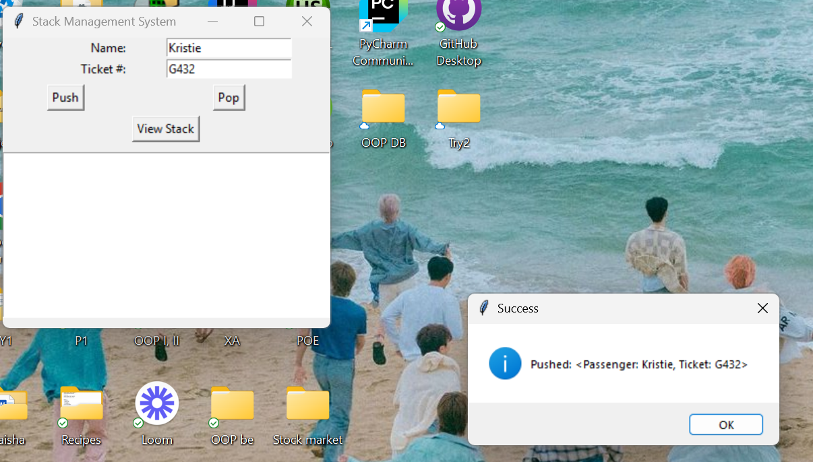

# DSA-SEM-PROJECT-
DATA STRUCTURES AND ALGORITHMS SEMESTER PROJECT

#Stack Module - Airline Reservation System
## Features
- Add (push) passengers to the stack
- Remove (pop) the most recent passenger
- View the current stack
- Stack operations persist with an SQLite database
- GUI built with Tkinter
- Unit-tested using pytest

## Project Structure
dsa-sem-project-404-not-found/
├── src/
│ └── stack_module/
│ ├── stack.py # Stack and Passenger classes
│ ├── stack_db.py # SQLite3 integration
│ ├── stack_ui.py # Tkinter GUI
│ ├── test_stack.py # Pytest unit tests
├── README.md

## How to run the App
1. Open terminal in the project root folder
2. Run the UI module with:
  - python -m src.stack_module.stack_ui

